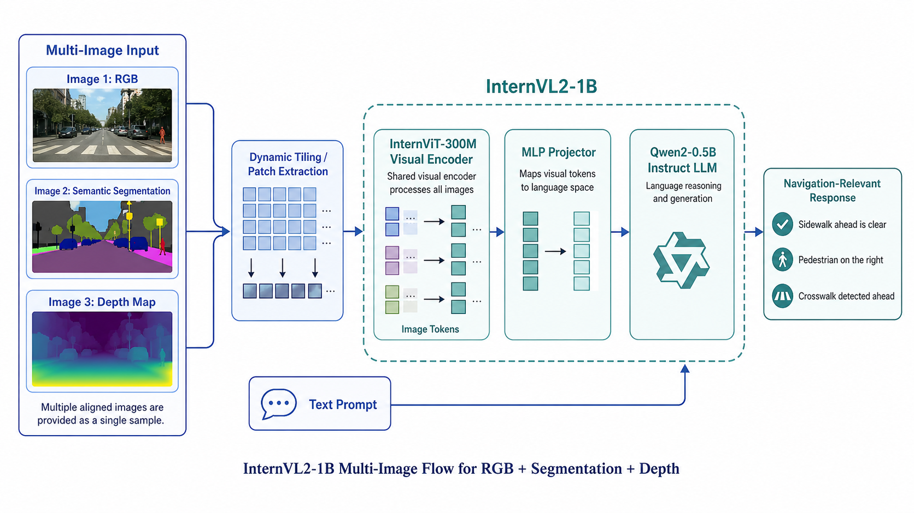

# WalkVL: Pedestrian-Centric Scene Understanding for Navigation


WalkVL explores pedestrian navigation with vision-language models conditioned on RGB, semantic segmentation, and depth cues. This repository includes a compact set of example inputs, segmentation/depth results, route demos, and presentation materials for the project.

## Project Materials

- [Slide deck](https://docs.google.com/presentation/d/1NGJPoBRbWxpnlnOHXVFDGby9GAbXLqCBP_rLQ6wy3f0/edit?usp=sharing)
- [Flowchart](assets/flowchart/walkvl_flowchart.png)



## Example Inputs and Results

| Type | Examples |
| --- | --- |
| Input overview | [inputs.jpg](assets/examples/inputs.jpg) |
| RGB frames | [sample_rgb_1.jpg](assets/examples/sample_rgb_1.jpg), [sample_rgb_2.jpg](assets/examples/sample_rgb_2.jpg) |
| Depth outputs | [sample_depth_1.jpg](assets/examples/sample_depth_1.jpg), [sample_depth_2.jpg](assets/examples/sample_depth_2.jpg) |
| Segmentation outputs | [segmentation_result_1.jpg](assets/examples/segmentation_result_1.jpg), [segmentation_result_2.jpg](assets/examples/segmentation_result_2.jpg) |

## Data Capture Setup

[train_00013_rgb_seg_2x2.gif](assets/data_capture/train_00013_rgb_seg_2x2.gif) shows an RGB and segmentation capture example used for the WalkVL data pipeline.


## Demo Videos

Each video shows the route-level comparison view with RGB context, RGB+Seg+Depth grid output, and frame-aligned WalkVL outputs.

| Route | Demo video | Text output |
| --- | --- | --- |
| Route 1 | [route1_combined_rgb_outputs_grid_30fps.mp4](demos/routes/route1_combined_rgb_outputs_grid_30fps.mp4) | [route1_frame_outputs.txt](demos/text_outputs/route1_frame_outputs.txt) |
| Route 4 | [Google Drive video](https://drive.google.com/file/d/10qfLX5ABsEWY8tXPCAmmHromHz329kq5/view?usp=sharing) | [route4_frame_outputs.txt](demos/text_outputs/route4_frame_outputs.txt) |
| Route 5 | [Google Drive video](https://drive.google.com/file/d/1YdLDH38NVnIanISUazNOmQocFRKMcoo6/view?usp=sharing) | [route5_frame_outputs.txt](demos/text_outputs/route5_frame_outputs.txt) |

## Repository Layout

```text
assets/
  data_capture/  RGB and segmentation capture setup GIF
  examples/      Input, RGB, segmentation, and depth examples
  flowchart/     WalkVL project flowchart
  logo/          WalkVL logo
demos/
  routes/        Compressed local route demo videos
  text_outputs/  Frame-aligned model output summaries
```
